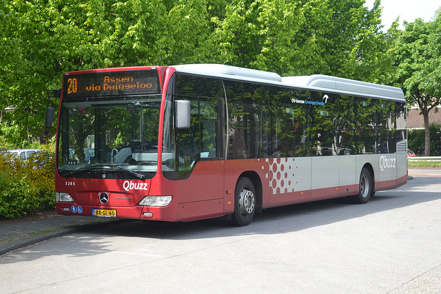
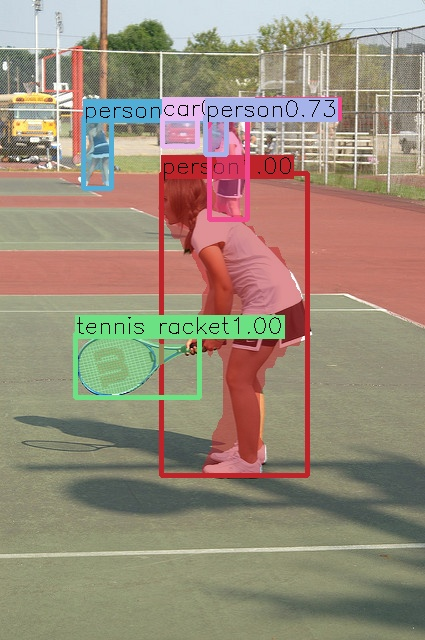
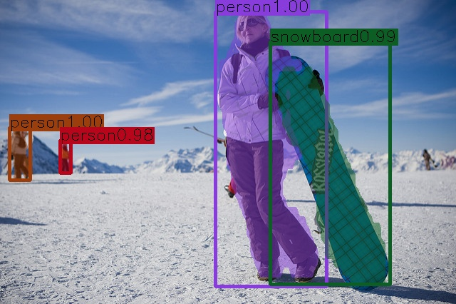
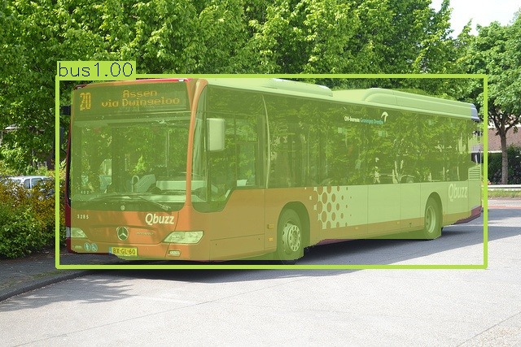
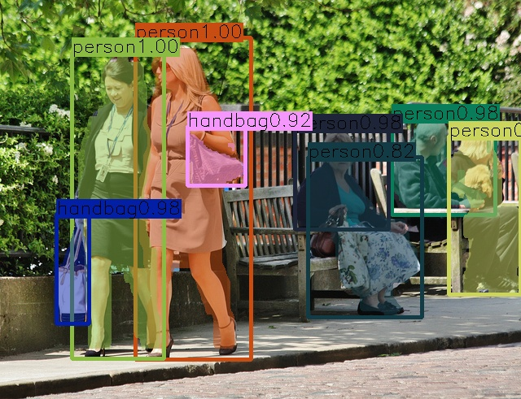

# Mask RCNN for TensorRT

这是一个将Keras模型转化为.uff的通用的一种做法！过程中使用了TensorRT的plugin,为了使用plugin,将Keras模型转换为Tensorflow的.pb模型，然后将.pb模型通过GraphSurgeon 和UFF转换为.uff模型.

主要涉及的Plugin

- `ResizeNearest` - Nearest neighbor interpolation for resizing features. This works for the FPN (Feature Pyramid Network) module.
- `ProposalLayer` - Generate the first stage's proposals based on anchors and RPN's (Region Proposal Network) outputs (scores, bbox_deltas).
- `PyramidROIAlign` - Crop and resize the feature of ROIs (first stage's proposals) from the corresponding feature layer.
- `DetectionLayer` - Refine the first stage's proposals to produce final detections.
- `SpecialSlice` - A workaround plugin to slice detection output [y1, x1, y2, x2, class_id, score] to [y1, x1, y2 , x2] for data with more than one index dimensions (batch_idx, proposal_idx, detections(y1, x1, y2, x2)).

> 注意：我们参考了TensorRT官方sample中的Mask RCNN的实现，请按照本Repo中要求配置环境，这样避免出现各种各样的错误（菜坑后的忠告），其次我们提供了独立易读的C++代码调用，不会像TensorRT sample中因为多层封装不易阅读。


### 1.模型说明

+ paper :[Mask R-CNN](https://arxiv.org/abs/1703.06870) 
+ GitHub:  [Mask R-CNN Github repository](https://github.com/matterport/Mask_RCNN)
+ 版本：2.0
+ model- ResNet 101+FPN: [https://github.com/matterport/Mask_RCNN/releases/download/v2.0/mask_rcnn_coco.h5](https://github.com/matterport/Mask_RCNN/releases/download/v2.0/mask_rcnn_coco.h5)

### 2.环境搭建

+  Docker镜像： nvcr.io/nvidia/tensorflow:18.12-py3   # tensorflow=1.12
+ uff=0.6.5
+ graphsurgeon=0.4.1
+ imageio=2.8.0
+ keras == 2.1.3
+ scikit-image

### 3.安装环境及TensorRT序列化

1. 安装必要的library

   我们基于基础的Tensorflow镜像进行安装` nvcr.io/nvidia/tensorflow:18.12-py3 `

```bash
sudo nvidia-docker run  nvcr.io/nvidia/tensorflow:18.12-py3 
cd ./converted/
pip3 install -r requirements.txt
pip3 install ./pylib/uff-0.6.5-py2.py3-none-any.whl
pip3 install ./pylib/graphsurgeon-0.4.1-py2.py3-none-any.whl
```

2. 修改uff库的代码：一般在 `/usr/lib/python3.6/dist-packages/uff/converters/tensorflow/converter_functions.py`.

```bash
uff_graph.conv_transpose(
    inputs[0], inputs[2], inputs[1],
    strides, padding,
    dilation=None, number_groups=number_groups,
    left_format=lhs_fmt, right_format=rhs_fmt,
    name=name, fields=fields
    )
```

3. 下载keras版Mask RCNN的代码库

```bash
git clone https://github.com/matterport/Mask_RCNN.git
```

4. 使用patch更新Mask RCNN代码库的代码，将代码中的NHWC转为NCHW

```bash
cd Mask_RCNN
git checkout 3deaec5
patch -p1 < ../0001-Update-the-Mask_RCNN-model-from-NHWC-to-NCHW.patch
cd -
```

5. 下载预训练的模型

```bash
wget https://github.com/matterport/Mask_RCNN/releases/download/v2.0/mask_rcnn_coco.h5
```

6. 将Keras模型转.pb并转为.uff

```bash
# 自己的模型得修改config.py!!!!
python3 mrcnn_to_trt_single.py -w ../mask_rcnn_coco.h5 -o ../mrcnn_nchw.uff -p ./config.py
```

7. trtexec 生成engine


```bash
trtexec --uff=mrcnn_nchw.uff --output=mrcnn_detection --output=mrcnn_mask/Sigmoid --uffInput=input_image,3,1024,1024 --saveEngine=mask.plan --workspace=3000 --verbose 
```

看到了pass恭喜你成功序列化Mask RCNN.

### 5.C++调用TensorRT模型进行识别

我们提供了Mask RCNN在C++下通过TensorRT调用识别的完整代码，其识别结果如下图所示:

|  |  |  |  |
| --------------------------------------- | --------------------------------------- | --------------------------------------- | --------------------------------------- |
|   |   |   |   |

